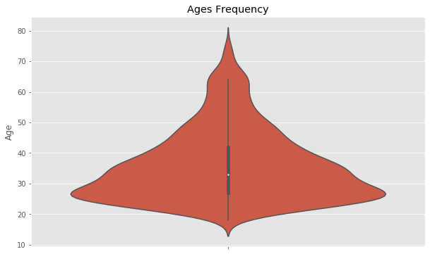

# K-Means Clustering for Customer Segmentation

## Overview
A short project where I use the unsupervised learning method K-Means clustering to segment customers at a large mall based on age and income data, and visualize the output. I also perform a exploratory data analysis to highlight further characteristics of the customers.

## Code and Resources Used

**Programming Language:** Python  
**Packages:** numpy, pandas, matplotlib, seaborn, scikit-learn  
**Dataset Source:** https://www.kaggle.com/datasets/dev0914sharma/customer-clustering

## EDA
I looked at the distributions of the data and the value counts for the various categorical variables. Below are a few highlights of age distributions, hometown size and employment status.  

## Model Building

K-Means Clustering

