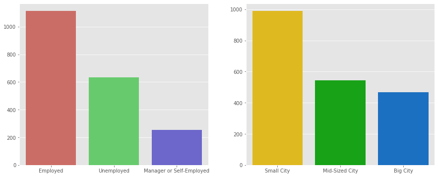

# K-Means Clustering for Customer Segmentation

## Overview
A short project where I use the unsupervised learning method K-Means clustering to segment customers at a large mall based on age and income data. I also perform a exploratory data analysis to visualize further characteristics of the customers.

## Code and Resources Used

**Programming Language:** Python  
**Packages:** numpy, pandas, matplotlib, seaborn, scikit-learn  
**Dataset Source:** https://www.kaggle.com/datasets/dev0914sharma/customer-clustering

## EDA

## Model Building

K-Means Clustering

