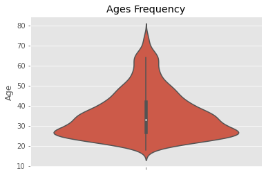
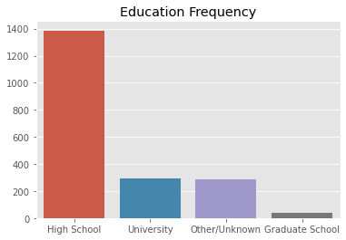
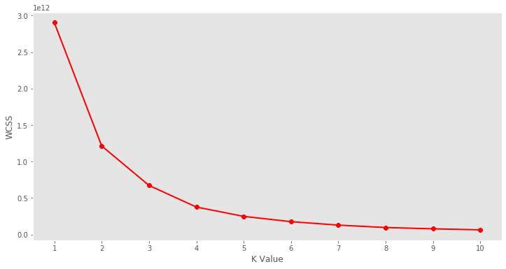
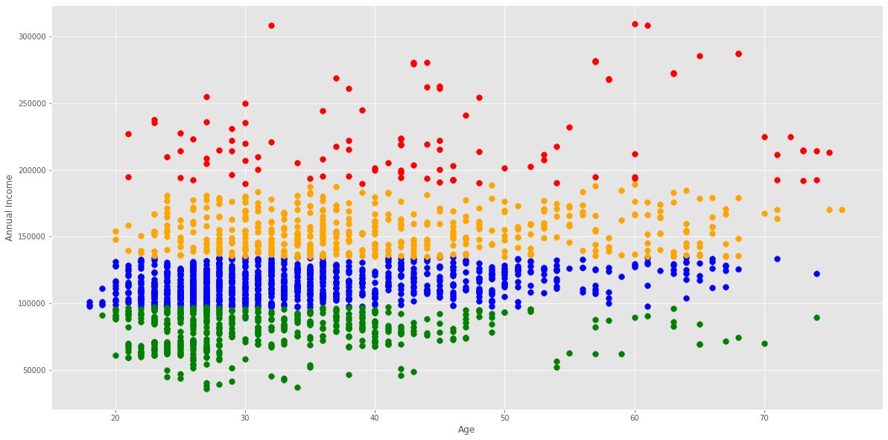

# K-Means Clustering for Customer Segmentation

## Overview
A short project where I use the unsupervised learning method K-Means clustering to segment customers at a large mall based on age and income data, and visualize the output. I also perform a exploratory data analysis to highlight further characteristics of the customers.

## Code and Resources Used

**Programming Language:** Python  
**Packages:** numpy, pandas, matplotlib, seaborn, scikit-learn  
**Dataset Source:** https://www.kaggle.com/datasets/dev0914sharma/customer-clustering

## EDA
I looked at the distributions of the data and the value counts for the various categorical variables. Below are a few highlights of age distributions and level of education.  
  

## Model Building

I computed the K-Means clustering for different values of K, ranging from 1 to 10 clusters. Then I calculated the total within-cluster sum of squares (WCSS) and plotted it against number of clusters, which can be seen below.  
  
Using the Elbow method I identified the location of the bend in the graph at K=4. The Elbow method says that the location of the bend is the indicator of an appropriate number of clusters. Then I plotted the KMeans with 4 clusters fitted on the age and income data.  

